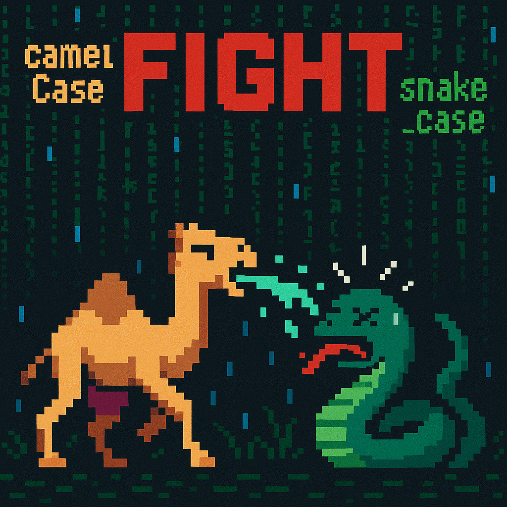

- ♥️ I realy interested in Computer Science.
- 👯 If i work - i work, i'm not watching tictok or play on phone.
- 🏦 I worked at a factory and I didn't like it at all.
- 💪 I like motivated people, and it's pleasure to work with them.
- ⚡ I like camelCase and i make my GIF on this topic. 

---

### :hammer_and_wrench: Languages and Tools :

  #### Languages
  &nbsp;
  &nbsp;
  &nbsp;

  #### Frontend
  &nbsp;
  &nbsp;
  &nbsp; 
  
  #### Backend
  &nbsp;
  &nbsp;
  &nbsp;
  
  #### Other
  &nbsp;
  &nbsp;
  &nbsp;
  

